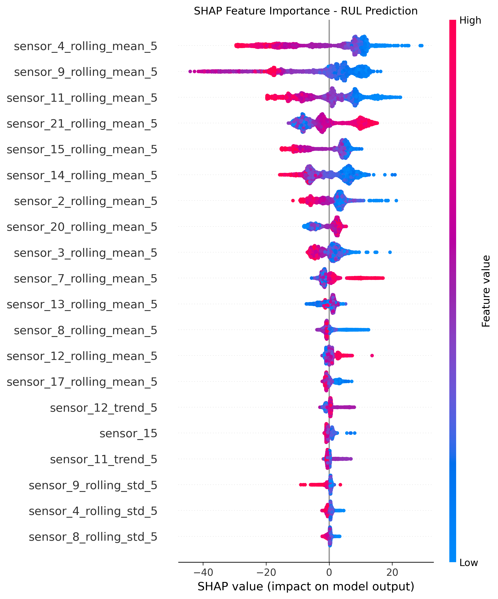

# ✈️ Intelligent Predictive Maintenance & RUL Estimation

An end-to-end **Machine Learning Predictive Maintenance system** for turbofan engines using the **NASA C-MAPSS FD001** dataset.

The system estimates **Remaining Useful Life (RUL)** from engine sensor telemetry and combines machine learning, feature engineering, explainable AI, anomaly detection, an interactive Gradio dashboard, and a FastAPI inference interface.

---

## 🚀 Project Overview

Predictive maintenance aims to identify equipment degradation early enough to support maintenance planning and reduce unexpected failures.

This project implements an end-to-end workflow:

**Raw Telemetry → Sensor Filtering → Feature Engineering → Model Training → RUL Prediction → Explainability → Anomaly Detection → Fleet Monitoring → API Deployment**

The system supports both individual-engine predictions and fleet-level analysis.

---

## 🎯 Key Capabilities

- Remaining Useful Life (RUL) estimation
- Sensor preprocessing and feature engineering
- Multiple regression model benchmarking
- Evaluation on the unseen NASA test fleet
- SHAP-based model explainability
- Isolation Forest anomaly detection
- Interactive **Gradio fleet dashboard**
- **FastAPI REST API** for model inference
- Reusable prediction logic in `src/predict.py`

---

## 🧠 Dataset

### NASA C-MAPSS FD001

The project uses the NASA C-MAPSS FD001 turbofan engine dataset.

The dataset contains:

- **100 training turbofan units** with run-to-failure histories
- **100 unseen test units**
- 21 sensor measurements
- 3 operational settings
- Engine unit and cycle identifiers
- Ground-truth RUL values for test evaluation

Raw data is organized as:

```text
data/raw/
├── train_FD001.txt
├── test_FD001.txt
└── RUL_FD001.txt
```

---

## 🔧 Data Preparation & Feature Engineering

Seven flat or near-constant sensors were removed:

```text
sensor_1
sensor_5
sensor_6
sensor_10
sensor_16
sensor_18
sensor_19
```

The final model uses the following 14 sensors:

```text
sensor_2
sensor_3
sensor_4
sensor_7
sensor_8
sensor_9
sensor_11
sensor_12
sensor_13
sensor_14
sensor_15
sensor_17
sensor_20
sensor_21
```

For each selected sensor, the pipeline generates:

- **5-cycle rolling mean**
- **5-cycle rolling standard deviation**
- **5-cycle trend differential (`diff(5)`)**

This produces a total of **56 model features**.

---

## 📊 Model Benchmarking

Three regression approaches were evaluated during model development:

| Model | Validation MAE | Validation RMSE | Validation R² |
|---|---:|---:|---:|
| Linear Regression | 29.48 | 37.43 | 0.6749 |
| Random Forest | 24.21 | 33.97 | 0.7323 |
| Gradient Boosting | 24.66 | 33.89 | 0.7335 |

The final saved predictive model is a **GradientBoostingRegressor**.

---

## 🏆 Unseen NASA Test Fleet Results

The final pipeline was evaluated against ground-truth RUL for **all 100 unseen test engines**.

| Metric | Result |
|---|---:|
| Test MAE | **24.20 cycles** |
| Test RMSE | **32.76 cycles** |
| NASA PHM Score | **34749.11** |
| Test Engines | **100** |

The final test predictions ranged approximately from **8.42 to 202.80 cycles**, with an average predicted RUL of approximately **95.86 cycles**.

---

## 🔍 Explainable AI

The project includes **SHAP (SHapley Additive exPlanations)** for model interpretation.

SHAP feature attributions help identify which engineered sensor signals contribute most strongly to individual RUL predictions and provide greater transparency into model behavior.
### SHAP Feature Importance



The generated SHAP visualization is available at:

```text
figures/shap_summary.png
```

---

## 🚨 Anomaly Detection

An **Isolation Forest** model is included as an additional health-monitoring component.

The anomaly detection workflow:

- learns patterns from healthy engine operating conditions
- identifies observations that deviate from healthy behavior
- supports degradation-onset analysis
- complements RUL prediction with an independent anomaly signal

---

## 🖥️ Interactive Gradio Dashboard

The project includes a multi-tab industrial monitoring dashboard.

### 1. Single Engine Inspector

Provides engine-level analysis including:

- predicted RUL
- health status
- maintenance recommendation
- sensor degradation trends
- individual engine diagnostics

### 2. Fleet Health & Priority Matrix

Provides fleet-level monitoring including:

- predicted RUL
- engine health status
- maintenance prioritization
- degradation trends

### 3. Batch Telemetry CSV Scoring

Allows telemetry CSV data to be processed through the prediction pipeline for batch engine scoring.

---

## ⚡ FastAPI REST API

A FastAPI application provides programmatic model inference.

### Endpoints

```text
GET /
GET /predict/engine/{unit_id}
```

Example:

```text
GET /predict/engine/1
```

The prediction response contains information such as:

```json
{
  "engine_id": 1,
  "last_recorded_cycle": 31,
  "predicted_rul": 175.96,
  "health_status": "...",
  "recommendation": "..."
}
```

The reusable inference implementation is located at:

```text
src/predict.py
```

---

## 🏗️ Project Structure

```text
Predictive-Maintenance-using-AI/
│
├── data/
│   └── raw/
│       ├── train_FD001.txt
│       ├── test_FD001.txt
│       └── RUL_FD001.txt
│
├── figures/
│   ├── sensor_rul_correlation_heatmap.png
│   └── shap_summary.png
│
├── results/
│   └── FINAL_PROJECT_REPORT.md
│
├── src/
│   └── predict.py
│
├── .gitignore
└── requirements.txt
```

Large generated artifacts such as trained model files, processed datasets, and generated CSV outputs are intentionally excluded from version control.

---

## 🛠️ Technology Stack

| Category | Technology |
|---|---|
| Programming Language | Python |
| Data Processing | Pandas, NumPy |
| Machine Learning | Scikit-learn |
| Regression Model | GradientBoostingRegressor |
| Anomaly Detection | Isolation Forest |
| Explainable AI | SHAP |
| Visualization | Matplotlib, Seaborn |
| Interactive Dashboard | Gradio |
| REST API | FastAPI |
| API Server | Uvicorn |
| Model Persistence | Joblib |

---

## 📦 Installation

Clone the repository:

```bash
git clone https://github.com/kashish-185/Predictive-Maintenance-using-AI.git
cd Predictive-Maintenance-using-AI
```

Create a virtual environment:

```bash
python -m venv venv
```

### Windows

```bash
venv\Scripts\activate
```

### Linux / macOS

```bash
source venv/bin/activate
```

Install the dependencies:

```bash
pip install -r requirements.txt
```

---

## ▶️ Prediction Pipeline

The reusable prediction module is:

```text
src/predict.py
```

Example usage:

```python
from src.predict import load_pipeline, predict_engine_rul

model, feature_cols = load_pipeline(
    "models/best_gradient_boosting_model.pkl",
    "models/feature_columns.pkl"
)

rul = predict_engine_rul(
    engine_df,
    model,
    feature_cols
)

print(f"Predicted RUL: {rul:.2f} cycles")
```

The trained model artifacts are excluded from Git because of repository artifact-management considerations and are generated/stored separately during the project workflow.

---

## 📈 Project Outputs

The project produces:

- model benchmarking results
- final unseen-fleet predictions
- RUL error analysis
- sensor/RUL correlation analysis
- SHAP explainability visualizations
- anomaly/degradation analysis
- fleet maintenance priority information
- REST API predictions
- interactive dashboard outputs

---

## 📄 Technical Report

The complete technical summary is available in:

[`results/FINAL_PROJECT_REPORT.md`](results/FINAL_PROJECT_REPORT.md)

The report covers:

- Executive Summary
- Dataset & Signal Processing
- Model Architecture & Benchmarking
- NASA Unseen Test Fleet Evaluation
- Deployment & Production Interfaces

---

## ⚠️ Limitations

This project is a research/prototype implementation using the NASA C-MAPSS FD001 benchmark dataset.

The reported performance represents benchmark performance on this dataset and should not be interpreted as production validation for a real aircraft fleet.

A production implementation would require additional work involving:

- real-world telemetry validation
- sensor calibration
- missing-data handling
- model monitoring
- model retraining
- safety and reliability validation
- infrastructure security
- integration with maintenance management systems

---

## 🔮 Future Improvements

Potential extensions include:

- LSTM/GRU/Transformer sequence models
- probabilistic RUL prediction
- prediction uncertainty intervals
- automated model retraining
- real-time telemetry streaming
- cloud deployment
- experiment tracking
- model registry
- CI/CD pipelines
- advanced fleet-level maintenance optimization

---
## 🌐 Live Demo

🚀 **[Open the Live Predictive Maintenance Dashboard](https://predictive-maintenance-using-ai.onrender.com/)**

The deployed application provides an interactive interface for:

- Engine-level RUL prediction
- Fleet health monitoring
- Health-status classification
- Maintenance recommendations
- ML-powered predictive maintenance analysis

> **Note:** The live application is a demonstration using the NASA C-MAPSS FD001 benchmark dataset. It is intended for research and portfolio demonstration rather than real aircraft maintenance decisions.

## 👤 Author

### Kashish Goel

GitHub: [@kashish-185](https://github.com/kashish-185)

---

## ⭐ Project Focus

**Machine Learning · Predictive Maintenance · Remaining Useful Life · Explainable AI · Anomaly Detection · Fleet Monitoring · FastAPI · Gradio**
